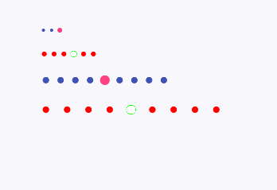

# LoadingDotsView
a user-defined view for loading or viewPager's indicator

    自定义的一个加载等待的控件，也可以做为viewPager的指示器，自己一个练手的自定义控件。
    请使用最新的DynamicLoadingView，更好的实现方式，更优化的代码。
    此控件可以自定义加载的小圆点的数量，间距，默认半径，默认颜色，指示颜色，颜色切换频率，半径浮动大小等。
没图说个结巴，看下面的效果图：



效果图的效果没有真机上看的效果好，见谅。

可以自定义的属性如下：

```java
<?xml version="1.0" encoding="utf-8"?>
<resources>
     <declare-styleable name="DynamicLoadingView">
        <attr name="count_number" format="integer"/><!--点的个数-->
        <attr name="item_spacing" format="dimension"/><!--点的间距-->
        <attr name="item_radius" format="dimension"/><!--点的半径-->
        <attr name="item_float_radius" format="dimension"/><!--点的半径浮动-->
        <attr name="item_default_color" format="color"/><!--点的默认颜色-->
        <attr name="item_change_color" format="color"/><!--点的选中颜色-->
        <attr name="item_auto_play" format="boolean"/><!--是否自动切换-->
        <attr name="item_play_delay" format="integer"/><!--悬停时间-->
    </declare-styleable>

    <declare-styleable name="RoundCornerImageView">
        <attr name="corner_radius" format="dimension"/>
    </declare-styleable>
</resources>
```

在布局文件中使用的方法如下：
```java
<com.***.DynamicLoadingView
        android:id="@+id/indicator"
        android:layout_width="wrap_content"
        android:layout_height="wrap_content"
        app:item_auto_play="true"
        app:item_change_color="@color/colorAccent"
        app:item_default_color="@color/colorPrimary"
        app:item_float_radius="@dimen/dp1"
        app:item_radius="@dimen/dp3"
        app:count_number="20"
        app:item_play_delay="2000"
        android:background="@color/color_88ffffff"
        app:item_spacing="@dimen/dp6"/>
```

本屌是混迹在`鸿洋`大神的`玩 Android 2群 423372824`的一个小透明，正在努力学习coding中……
